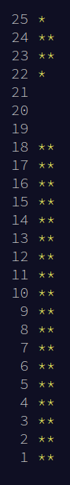

# AoC 2022

This is my attempt at the [Advent of Code 2022](https://adventofcode.com/2022) challenges. I started a bit late and completed as much as I could before December 25th but a couple days still alluded me.



## Usage

```bash
$ yarn generate -- <day>

$ yarn build:watch -- <day>
```
